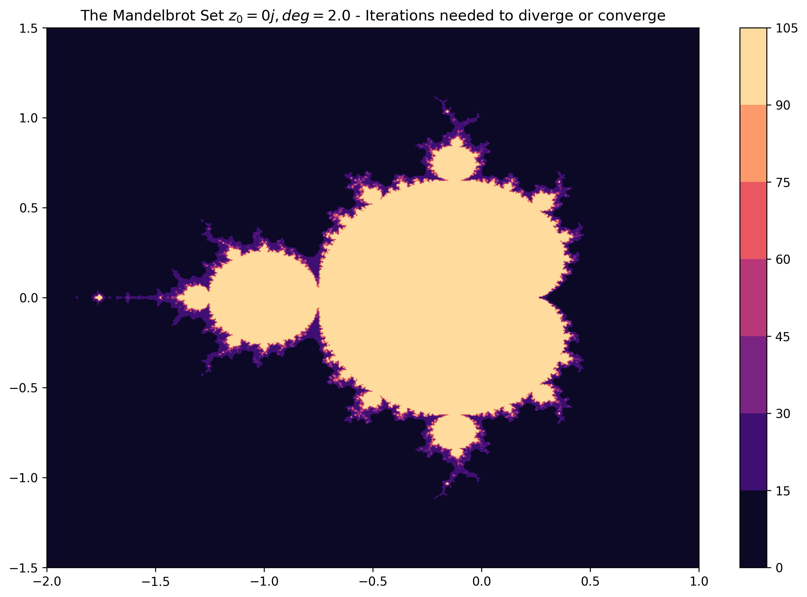

# Mandelbrot and Related Sets Visualization in Python
A python script for visualizing the Mandelbrot and related sets of the form z^(deg) + c. 
More information about the Mandelbrot set can be found [here](https://en.wikipedia.org/wiki/Mandelbrot_set).


## Installation

1. Clone the repository to local machine.
```
git clone https://github.com/JohnNellas/MandelbrotAndRelatedSetsVisPython.git
```
2. Move inside the cloned directory entitled ```MandelbrotAndRelatedSetsVisPython```.
```
cd MandelbrotAndRelatedSetsVisPython
```
3. Install the required modules from the ```requirements.txt``` file.
```
pip install -r requirements.txt
```
4. See the documentation of the main program ```main.py```.
```
python3 main.py --help

usage: main.py [-h] [--z0 Z0] [--c_a_minmax C_AMIN C_AMAX] [--c_b_minmax C_BMIN C_BMAX] [--n_points N_POINTS] [--degree DEGREE] [--nIter NITER] [--boundary BOUNDARY] [--savePath SAVEPATH]
               [--format {jpg,png,pdf}]

A python script for visualizing Mandelbrot and related sets of the form (z^deg) + c.

optional arguments:
  -h, --help            show this help message and exit
  --z0 Z0               The starting value of z_{n}.
  --c_a_minmax C_AMIN C_AMAX
                        The min and max values for the real part of c terms to be examined.
  --c_b_minmax C_BMIN C_BMAX
                        The min and max values for the imaginary part of c terms to be examined.
  --n_points N_POINTS   The number of points to obtain between the specified min max intervals.
  --degree DEGREE       The degree of z_{n}.
  --nIter NITER         The number of iterations to check for divergence.
  --boundary BOUNDARY   The divergence boundary.
  --savePath SAVEPATH   The target directory to save the generated figures (if it does not exist, it will be created).
  --format {jpg,png,pdf}
                        The format to save the generated figures (choices: png, jpg, pdf).

```

### Example
Visualize the Mandelbrot set and save the generated figures with jpeg format in the target directory ```figures``` 
(if the specified directory does not exist then it will be created).
```
python3 main.py --z0 0 --deg 2 --savePath figures --format jpg
```

#### Results
The execution of the aforementioned command will result in creating a directory entitled ```figures``` which will contain
the following figures.



